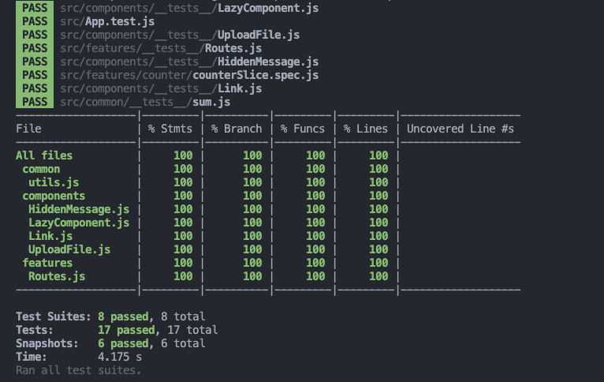

# 前端单元测试说明

- [前端单元测试说明](#前端单元测试说明)
  - [测试框架 Jest](#测试框架-jest)
  - [使用](#使用)
  - [测试文件](#测试文件)
  - [Demo](#demo)
    - [测试简单函数](#测试简单函数)
    - [测试简单组件](#测试简单组件)
    - [测试懒加载组件](#测试懒加载组件)
    - [测试路由组件](#测试路由组件)
    - [测试 Rudux](#测试-rudux)
    - [测试 Hooks](#测试-hooks)
  - [Snapshot Testing](#snapshot-testing)
  - [生成测试覆盖率报告](#生成测试覆盖率报告)

## 测试框架 Jest

Jest 是 Facebook 出品的一个测试框架，相对其他测试框架，其一大特点就是就是内置了常用的测试工具，比如自带断言、测试覆盖率工具，实现了开箱即用
而作为一个面向前端的测试框架， Jest 可以利用其特有的快照测试功能，通过比对 UI 代码生成的快照文件，实现对 React 等常见框架的自动测试。
此外， Jest 的测试用例是并行执行的，而且只执行发生改变的文件所对应的测试，提升了测试速度。

## 使用

- @testing-library/react
- @testing-library/jest-dom  
- @testing-library/user-event

在 create-react-app 项目中将自动集成这些测试库，可更新至最新版本以支持更丰富的 API

CLI 命令

```sh
npm run test
```

可按以下模式执行

```sh
 › Press a to run all tests.
 › Press f to run only failed tests.
 › Press q to quit watch mode.
 › Press p to filter by a filename regex pattern.
 › Press t to filter by a test name regex pattern.
```

## 测试文件

Jest 将自动查找符合以下命名规则的测试文件：

- `__tests__` 文件夹中带有 .js 后缀的文件
- 带有 .test.js 后缀的文件
- 带有 .spec.js 后缀的文件

建议将测试文件或者测试文件夹（__tests__）置于测试代码相同路径下

## Demo

### 测试简单函数

`sum.js`

```js
function sum(a, b) {
  return a + b;
}
```

`__tests__/sum.js`

```js
import { sum } from '../sum'
test('adds 1 + 2 to equal 3', () => {
  expect(sum(1, 2)).toBe(3);
});
```

### 测试简单组件

`HiddenMessage.js`

```js
function HiddenMessage({ children }) {
  const [showMessage, setShowMessage] = React.useState(false);
  return (
    <div>
      <label htmlFor="toggle">Show Message</label>
      <input
        id="toggle"
        type="checkbox"
        onChange={(e) => setShowMessage(e.target.checked)}
        checked={showMessage}
      />
      {showMessage ? children : null}
    </div>
  );
}
```

`__tests__/HiddenMessage.js`

```js
import { render, fireEvent, screen } from '@testing-library/react';
import HiddenMessage from '../HiddenMessage';

test('shows the children when the checkbox is checked', () => {
  const testMessage = 'Test Message';
  render(<HiddenMessage>{testMessage}</HiddenMessage>);

  expect(screen.queryByText(testMessage)).toBeNull();

  fireEvent.click(screen.getByLabelText(/show/i));

  expect(screen.getByText(testMessage)).toBeInTheDocument();
});
```

### 测试懒加载组件

`LazyComponent.js`

```js
function LazyComponent() {
  return <div>I am lazy!</div>
}
```

`__tests__/LazyComponent.js`

```js
import * as React from 'react';
import { render, screen } from '@testing-library/react';

const LazyComponent = React.lazy(() => import('../LazyComponent'));

function Main() {
  return (
    <div>
      <div>Lazy loaded component is here:</div>
      <LazyComponent />
    </div>
  );
}

function App() {
  return (
    <React.Suspense fallback="loading...">
      <Main />
    </React.Suspense>
  );
}

test('renders lazy', async () => {
  render(
    <React.Suspense fallback="test loading">
      <Main />
    </React.Suspense>
  );
  const lazyElement = await screen.findByText(/i am lazy/i);
  expect(lazyElement).toBeInTheDocument();
});

test('app renders stuff!', async () => {
  render(<App />);
  const lazyElement = await screen.findByText(/i am lazy/i);
  expect(lazyElement).toBeInTheDocument();
});
```

### 测试路由组件

`Routes.js`

```js
import * as React from 'react'
import {
  Link,
  Route,
  Switch,
  useLocation,
} from 'react-router-dom'

const About = () => <div>You are on the about page</div>
const Home = () => <div>You are home</div>
const NoMatch = () => <div>No match</div>

export const LocationDisplay = () => {
  const location = useLocation()

  return <div data-testid="location-display">{location.pathname}</div>
}

const Routes = () => (
  <div>
    <Link to="/">Home</Link>

    <Link to="/about">About</Link>

    <Switch>
      <Route exact path="/">
        <Home />
      </Route>

      <Route path="/about">
        <About />
      </Route>

      <Route>
        <NoMatch />
      </Route>
    </Switch>

    <LocationDisplay />
  </div>
)

export default Routes;
```

`__tests/Routes.js`

```js
import {render as rtlRender, screen} from '@testing-library/react'
import userEvent from '@testing-library/user-event'
import * as React from 'react'
import {
  BrowserRouter as Router,
} from 'react-router-dom'

import Routes, { LocationDisplay } from '../Routes'

const render = (ui, {route = '/'} = {}) => {
  window.history.pushState({}, 'Test page', route)

  return rtlRender(ui, {wrapper: Router})
}

test('full app rendering/navigating', () => {
  render(<Routes />)
  expect(screen.getByText(/you are home/i)).toBeInTheDocument()

  userEvent.click(screen.getByText(/about/i))

  expect(screen.getByText(/you are on the about page/i)).toBeInTheDocument()
})

test('landing on a bad page', () => {
  render(<Routes />, {route: '/something-that-does-not-match'})

  expect(screen.getByText(/no match/i)).toBeInTheDocument()
})

test('rendering a component that uses useLocation', () => {
  const route = '/some-route'
  render(<LocationDisplay />, {route})

  // avoid using test IDs when you can
  expect(screen.getByTestId('location-display')).toHaveTextContent(route)
})
```

### 测试 Rudux

`counterSlice.js`

```js
import { createAsyncThunk, createSlice } from '@reduxjs/toolkit';
import { fetchCount } from './counterAPI';

const initialState = {
  value: 0,
  status: 'idle',
};

export const incrementAsync = createAsyncThunk(
  'counter/fetchCount',
  async (amount) => {
    const response = await fetchCount(amount);
    return response.data;
  }
);

export const counterSlice = createSlice({
  name: 'counter',
  initialState,
  reducers: {
    increment: (state) => {
      state.value += 1;
    },
    decrement: (state) => {
      state.value -= 1;
    },
    incrementByAmount: (state, action) => {
      state.value += action.payload;
    },
  },
  extraReducers: (builder) => {
    builder
      .addCase(incrementAsync.pending, (state) => {
        state.status = 'loading';
      })
      .addCase(incrementAsync.fulfilled, (state, action) => {
        state.status = 'idle';
        state.value += action.payload;
      });
  },
});

export const { increment, decrement, incrementByAmount } = counterSlice.actions;

export const selectCount = (state) => state.counter.value;

export const incrementIfOdd = (amount) => (dispatch, getState) => {
  const currentValue = selectCount(getState());
  if (currentValue % 2 === 1) {
    dispatch(incrementByAmount(amount));
  }
};

export default counterSlice.reducer;
```

`__tests__/counterSlice.js`

```js
import counterReducer, {
  increment,
  decrement,
  incrementByAmount,
} from './counterSlice';

describe('counter reducer', () => {
  const initialState = {
    value: 3,
    status: 'idle',
  };
  it('should handle initial state', () => {
    expect(counterReducer(undefined, { type: 'unknown' })).toEqual({
      value: 0,
      status: 'idle',
    });
  });

  it('should handle increment', () => {
    const actual = counterReducer(initialState, increment());
    expect(actual.value).toEqual(4);
  });

  it('should handle decrement', () => {
    const actual = counterReducer(initialState, decrement());
    expect(actual.value).toEqual(2);
  });

  it('should handle incrementByAmount', () => {
    const actual = counterReducer(initialState, incrementByAmount(2));
    expect(actual.value).toEqual(5);
  });
});

```

### 测试 Hooks

可引入第三方库 @testing-library/react-hooks

```sh
npm install -D @testing-library/react-hooks
```

简单示例

`useCounter.js`

```js
import { useState, useCallback } from 'react'

function useCounter() {
  const [count, setCount] = useState(0)
  const increment = useCallback(() => setCount((x) => x + 1), [])
  return { count, increment }
}
```

`useCounter.test.js`

```js
import { renderHook, act } from '@testing-library/react-hooks'
import useCounter from './useCounter'

test('should increment counter', () => {
  const { result } = renderHook(() => useCounter())
  act(() => {
    result.current.increment()
  })
  expect(result.current.count).toBe(1)
})
```

## Snapshot Testing

需要额外安装 react-test-renderer

```sh
npm install -D react-test-renderer
```

简单示例

`Link.js`

```js
import React, { useState } from 'react';

const STATUS = {
  HOVERED: 'hovered',
  NORMAL: 'normal',
};

const Link = ({ page, children }) => {
  const [status, setStatus] = useState(STATUS.NORMAL);

  const onMouseEnter = () => {
    setStatus(STATUS.HOVERED);
  };

  const onMouseLeave = () => {
    setStatus(STATUS.NORMAL);
  };

  return (
    <a
      className={status}
      href={page || '#'}
      onMouseEnter={onMouseEnter}
      onMouseLeave={onMouseLeave}
    >
      {children}
    </a>
  );
};
```

`__tests__/Link.js`

```js- [单元测试说明](#单元测试说明)
  - [测试框架 Jest](#测试框架-jest)
  - [使用](#使用)
  - [测试文件](#测试文件)
  - [Demo](#demo)
    - [测试简单函数](#测试简单函数)
    - [测试简单组件](#测试简单组件)
    - [测试懒加载组件](#测试懒加载组件)
    - [测试路由组件](#测试路由组件)
    - [测试 Rudux](#测试-rudux)
    - [测试 Hooks](#测试-hooks)
  - [Snapshot Testing](#snapshot-testing)
  - [生成测试覆盖率报告](#生成测试覆盖率报告)
import React from 'react';
import renderer from 'react-test-renderer';
import Link from '../Link';

const { act, create } = renderer;

it('renders correctly', () => {
  const tree = renderer
    .create(<Link page="http://www.facebook.com">Facebook</Link>)
    .toJSON();
  expect(tree).toMatchSnapshot();
});

it('renders as an anchor when no page is set', () => {
  const tree = renderer.create(<Link>Facebook</Link>).toJSON();
  expect(tree).toMatchSnapshot();
});

it('properly escapes quotes', () => {
  const tree = renderer
    .create(<Link>{"\"Facebook\" \\'is \\ 'awesome'"}</Link>)
    .toJSON();
  expect(tree).toMatchSnapshot();
});

test('Link changes the class when hovered', () => {
  const component = create(
    <Link page="http://www.facebook.com">Facebook</Link>,
  );
  let tree = component.toJSON();
  expect(tree).toMatchSnapshot();

  // manually trigger the callback
  act(() => {
    tree.props.onMouseEnter();
  });
  
  // re-rendering
  tree = component.toJSON();
  expect(tree).toMatchSnapshot();

  // manually trigger the callback
  act(() => {
    tree.props.onMouseLeave();
  });
  // re-rendering
  tree = component.toJSON();
  expect(tree).toMatchSnapshot();
});
```

## 生成测试覆盖率报告

整个项目收集代码覆盖面信息，包括未经测试的文件

```sh
npm test -- --coverage
```


